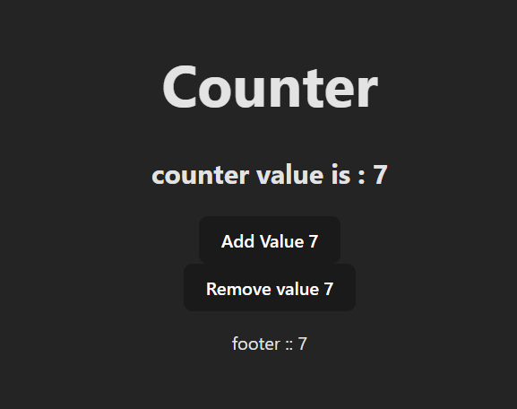
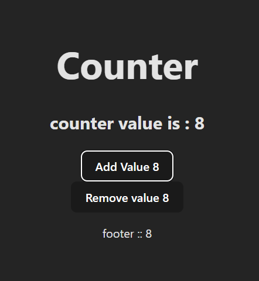
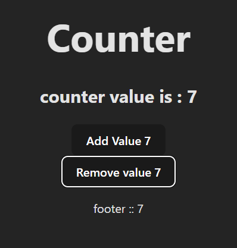

### what to learn
hooks like useState
```javascript
import { useState } from 'react'

import './App.css'

function App() {

  let [counter, setCounter] = useState(5)


  const addValue = () =>{
    if (counter > 19) return;

    //State updates are [asynchronous] and batched

    //All lines use the same old value of counter — they don’t wait for the first setCounter to finish before executing the next one.

    // setCounter(counter + 1);
    // setCounter(counter + 1);
    // setCounter(counter + 1);
    // setCounter(counter + 1);

    setCounter((prevCounter) => prevCounter + 1);
    // setCounter((prevCounter) => prevCounter + 1);
    // setCounter((prevCounter) => prevCounter + 1);
  }

  const removeValue = () => {
    if (counter < 1) return
    setCounter(counter-1)
  }

  return (
    <>
    <h1>Counter</h1>
    <h2>counter value is : {counter}</h2>
    <button onClick={addValue}>Add Value {counter}</button>
    <br/>
    <button onClick={removeValue}>Remove value {counter}</button>
    <p> footer ::  {counter}</p>
    </>
  )
}

export default App

```
### Screenshot



