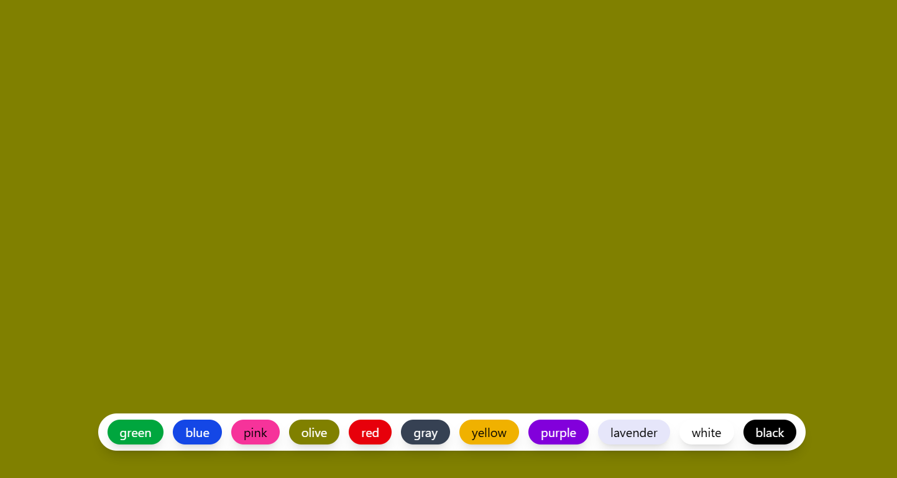

learned about usecase of useState hook

### Code for app.jsx
```javascript

import { useState } from "react";

import "./App.css";

function App() {
  const [color, setColor] = useState("olive");

  return (
    <div
      className="w-full h-screen duration-200"
      style={{ backgroundColor: color }}
    >
      <div className="fixed flex flex-wrap justify-center bottom-12 inset-x-0 px-2">
        <div className="flex flex-wrap justify-center gap-3 shadow-lg bg-white px-3 py-2 rounded-3xl">
          <button
            onClick={() => setColor("green")}
            className="outline-none px-4 py-1 rounded-full text-white shadow-lg bg-green-600"
          >
            green
          </button>

          <button
            onClick={() => setColor("blue")}
            className="outline-none px-4 py-1 rounded-full text-white shadow-lg bg-blue-700"
          >
            blue
          </button>

          <button
            onClick={() => setColor("pink")}
            className="outline-none px-4 py-1 rounded-full text-black shadow-lg bg-pink-500"
          >
            pink
          </button>

          <button
            onClick={() => setColor("olive")}
            className="outline-none px-4 py-1 rounded-full text-white shadow-lg"
            style={{ backgroundColor: "olive" }}
          >
            olive
          </button>

          <button
            onClick={() => setColor("red")}
            className="outline-none px-4 py-1 rounded-full text-white  bg-red-600 shadow-lg"
          >
            red
          </button>

          <button
            onClick={() => setColor("gray")}
            className="outline-none px-4 py-1 rounded-full text-white bg-gray-700 shadow-lg"
          >
            gray
          </button>

          <button
            onClick={() => setColor("yellow")}
            className="outline-none px-4 py-1 rounded-full text-black bg-yellow-500 shadow-lg"
          >
            yellow
          </button>

          <button
            onClick={() => setColor("purple")}
            className="outline-none px-4 py-1 rounded-full text-white bg-purple-700 shadow-lg"
          >
            purple
          </button>

          <button
            onClick={() => setColor("lavender")}
            className="outline-none px-4 py-1 rounded-full text-black shadow-lg"
            style={{ backgroundColor: "lavender" }}
          >
            lavender
          </button>

          <button
            onClick={() => setColor("white")}
            className="outline-none px-4 py-1 rounded-full text-black bg-white shadow-lg"
          >
            white
          </button>

          <button
            onClick={() => setColor("black")}
            className="outline-none px-4 py-1 rounded-full text-white bg-black shadow-lg"
          >
            black
          </button>
        </div>
      </div>
    </div>
  );
}

export default App;

```
### Screenshot

