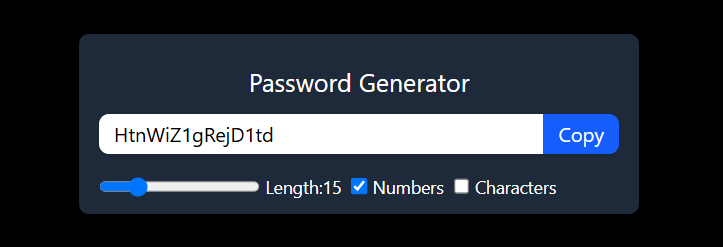

## hooks learned:
useState , useCallback, useRef

### code for app.jsx

```javascript
import { useState, useCallback, useEffect, useRef } from "react";

function App() {
  const [length, setLength] = useState(8);
  const [numberAllowed, setNumberAllowed] = useState(false);
  const [characterAllowed, setCharacterAllowed] = useState(false);
  const [password, setPassword] = useState("");

  //useRef hook
  //to select copied text 
  const passwordRef = useRef(null)

  const passwordGenertor = useCallback(() => {
    let pass = "";
    let str = "QWERTYUIOPLKJHGFDSAZXCVBNMqwertyuioplkjhgfdsazxcvbnm";

    if (numberAllowed) str += "0123456789";
    if (characterAllowed) str += "!@#$%^&*()_+=-[];',./<>?:{}|";

    for (let i = 1; i <= length; i++) {
      let char = Math.floor(Math.random() * str.length + 1);
      pass = pass + str.charAt(char);
    }

    setPassword(pass);
    //USECALLBACK => whenever any change in these dependencies put changes in cache ==> OPTIMISATION 
  }, [length, numberAllowed, characterAllowed, setPassword]);


  const copyPasswordToClipboard = useCallback(() => {
    passwordRef.current?.select()

    // passwordRef.current?.setSelectionRange(0,20)

    window.navigator.clipboard.writeText(password)
  }, [password])

  useEffect(() => {
    passwordGenertor();
    // called when page loads at first time
    // USEEFFECT => whenever any change in these dependencies rerun the setup i.e passwordGenertor()
  }, [length, numberAllowed, characterAllowed])


  return (
    <>
      <div className="w-full max-w-md mx-auto shadow-md rounded-lg px-4 py-3 my-8 text-white bg-gray-800">
        <h1 className="text-white text-center text-xl my-3">Password Generator</h1>
        <div className="flex shadow rounded-lg overflow-hidden mb-4">
          <input
            type="text"
            value={password}
            className="otline-none w-full py-1 px-3 bg-white text-black"
            placeholder="password"
            readOnly
            ref={passwordRef}
          />
          <button 
          onClick={copyPasswordToClipboard}
          className="outline-none text-white bg-blue-600 px-3 py-0.5 shrink-0 hover:bg-blue-800 cursor-pointer">
            Copy
          </button>
        </div>
        <div className="flex text-sm gap-x-2">
          <div className="flex item-center gap-x-1">
            <input
              type="range"
              min={6}
              max={50}
              value={length}
              className="cursor-pointer"
              onChange={(e) => {
                setLength(e.target.value);
              }}
            />
            <label>Length:{length}</label>
          </div>

          <div className="flex items-center gap-x-1">
            <input
              type="checkbox"
              defaultChecked={numberAllowed}
              id="numberInput"
              onChange={() => {
                setNumberAllowed((prev) => !prev);
              }}
            />
            <label>Numbers</label>
          </div>

          <div className="flex items-center gap-x-1">
            <input
              type="checkbox"
              defaultChecked={characterAllowed}
              id="numberInput"
              onChange={() => {
                setCharacterAllowed((prev) => !prev);
              }}
            />
            <label>Characters</label>
          </div>
        </div>
      </div>
    </>
  );
}

export default App;

```

