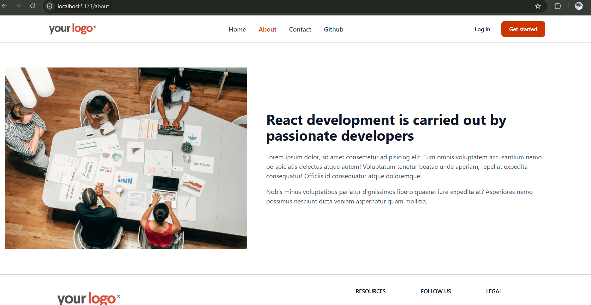
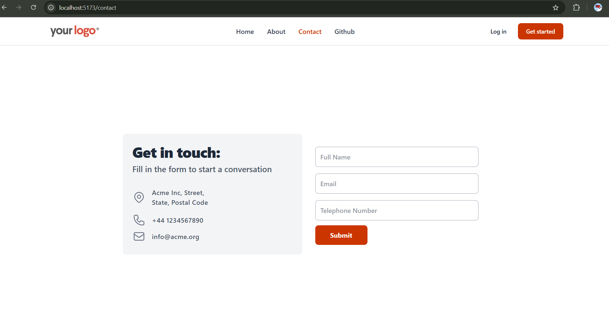

# learned about

```javascript

react-router-dom // react-router-dom is a library for routing in React applications
Link // Link is used to navigate between pages
NavLink // NavLink is used to navigate between pages with active class
useParams() // useParams is used to get the parameters from the URL
useLoaderData() // useLoaderData is used to get the data from the loader function
Layout // Layout is used to create a common layout for all the pages
loader() // loader is used to fetch data before rendering the component
createRoot() // createRoot is used to render the React application
createBrowserRouter() // createBrowserRouter is used to create a router for the application and manage the navigation
createRoutesFromElements() // createRoutesFromElements is used to create routes from the elements and define the structure of the application
Route // Route is used to define a route in the application and map it to a component
RouterProvider() // RouterProvider is used to provide the router to the application

```

# screenshots




