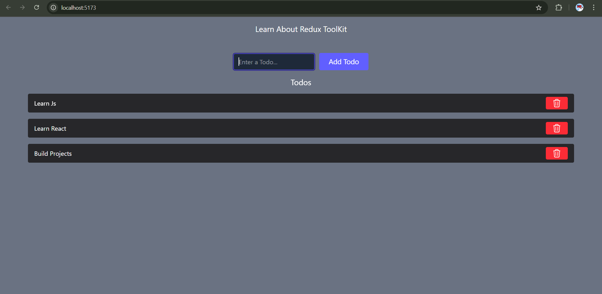
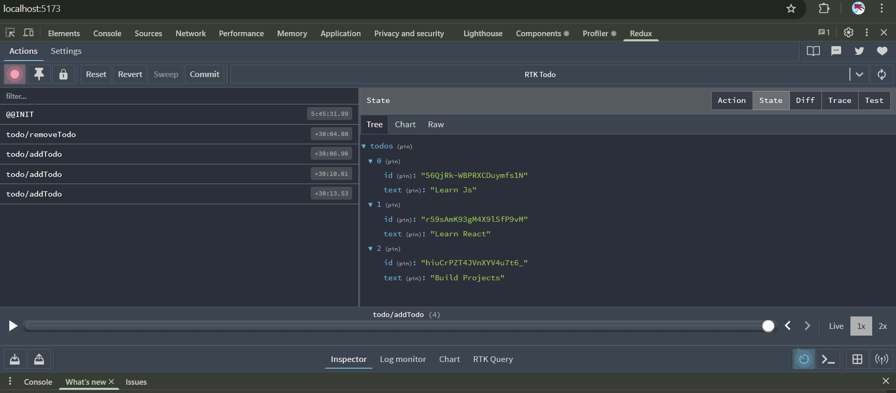

# What we learnt in this project
- How to use Redux Toolkit to manage state in a React application.
- How to create slices, actions, and reducers using Redux Toolkit.
- How to configure the Redux store and integrate it with a React application.

# Redux Toolkit Todo App
This project is a simple Todo application built using React and Redux Toolkit. It demonstrates how to manage state in a React application using Redux Toolkit, which simplifies the process of writing Redux logic.

### Screenshot

# How it looks

# Redux Extension

